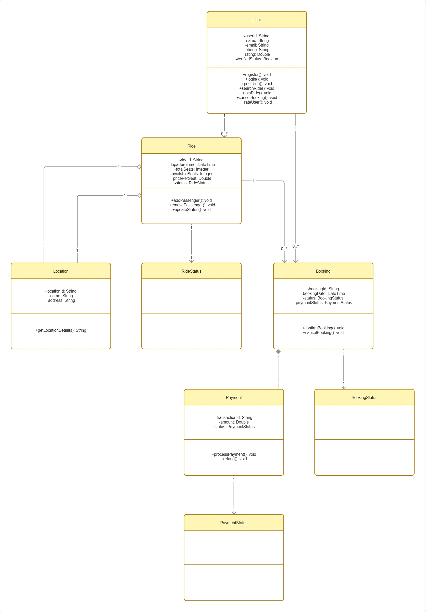
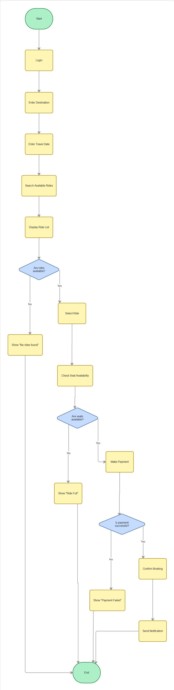
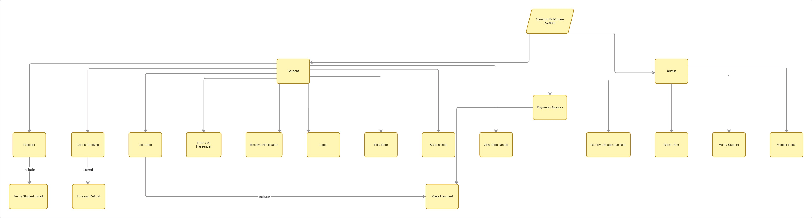

# Ride — Campus Ride Coordination

A simple, private ride-pooling platform for trusted campuses — web-first PWA backed by a centralized API.

Quick visuals: see the [Diagrams](#diagrams) section below for links and thumbnails.

## Diagrams
- [](https://miro.com/app/live-embed/uXjVG69RjQo=/?focusWidget=3458764661321821290&embedMode=view_only_without_ui&embedId=461261242655)
- [](https://miro.com/app/live-embed/uXjVG69RjQo=/?focusWidget=3458764661321735307&embedMode=view_only_without_ui&embedId=461261242655)
- [](https://miro.com/app/live-embed/uXjVG69RjQo=/?focusWidget=3458764661321654483&embedMode=view_only_without_ui&embedId=461261242655)

## What

Backend-driven ride coordination for campuses (Users, Rides, Bookings, Payments, Ratings). Web-first PWA for fast iteration.

## Quickstart

- Prereqs: Node.js (LTS), npm

Install and run:

```bash
npm install
npm run dev
```

## Tech & Principles

- Next.js PWA frontend; centralized REST API + relational DB as the single source of truth; realtime updates via WebSocket/SSE; college-only access via SSO/allowlist.

## Project Issues & Roadmap

This project uses GitHub Issues for tracking development. A complete issue set with dependencies is available in [`.github/issues.json`](.github/issues.json).

### Create All Issues at Once

To create all 30 issues with dependencies in your repo:

1. Go to **Actions** → **Create Project Issues** workflow
2. Click **Run workflow** → **Run workflow** (or use dry-run mode to preview)
3. Issues are created with:
   - **Categories** (Foundation, Authentication, RideManagement, Booking, Payment, Notification, Frontend, Quality, DevOps)
   - **Priority labels** (High, Medium, Low)
   - **Acceptance criteria** for each issue
   - **Dependency references** for build order

**Note:** The workflow checks for duplicates before creating, so it's safe to run multiple times.

## Next steps

- Want me to export these Miro frames as images into `public/digrams/` and add thumbnails here?

---

Built by the Openverse-IIITK community.
This is a [Next.js](https://nextjs.org) project bootstrapped with [`create-next-app`](https://nextjs.org/docs/app/api-reference/cli/create-next-app).

## Getting Started

First, run the development server:

```bash
npm run dev
# or
yarn dev
# or
pnpm dev
# or
bun dev
```

Open [http://localhost:3000](http://localhost:3000) with your browser to see the result.

You can start editing the page by modifying `app/page.tsx`. The page auto-updates as you edit the file.

This project uses [`next/font`](https://nextjs.org/docs/app/building-your-application/optimizing/fonts) to automatically optimize and load [Geist](https://vercel.com/font), a new font family for Vercel.

## Learn More

To learn more about Next.js, take a look at the following resources:

- [Next.js Documentation](https://nextjs.org/docs) - learn about Next.js features and API.
- [Learn Next.js](https://nextjs.org/learn) - an interactive Next.js tutorial.

You can check out [the Next.js GitHub repository](https://github.com/vercel/next.js) - your feedback and contributions are welcome!

## Deploy on Vercel

The easiest way to deploy your Next.js app is to use the [Vercel Platform](https://vercel.com/new?utm_medium=default-template&filter=next.js&utm_source=create-next-app&utm_campaign=create-next-app-readme) from the creators of Next.js.

Check out our [Next.js deployment documentation](https://nextjs.org/docs/app/building-your-application/deploying) for more details.
